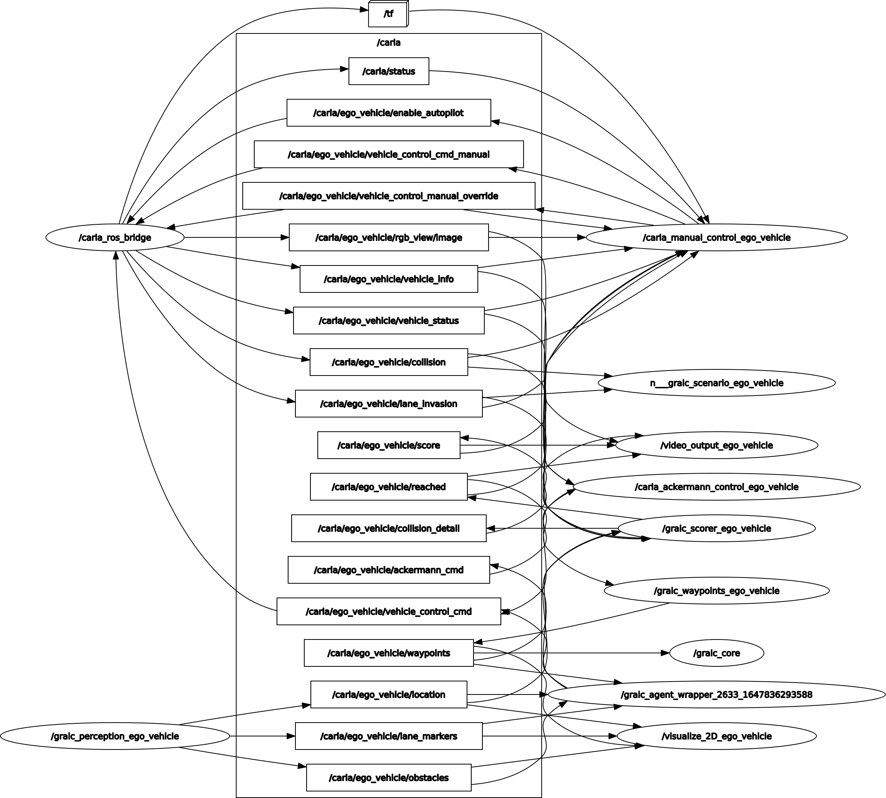

# GRAIC22DC

The decision and control module for GRAIC22

## Submission 1

| **Track Name** | **Score** | **Notes**                              |
|----------------|-----------|----------------------------------------|
| t1_triple      | 56        | No Penalties                           |
| t2_triple      | 80?       | No Penalties - simulation dies halfway |
| t3             | 264       | 2 Collisons with Pedestrians           |
| t3             | 74        | No Penalties                           |
| track5         | 193       | One Collision with a Vehicle           | 

## Name
Choose a self-explaining name for your project.

## Description
Decision and Control (D&C) module for GRAIC'22.

## Installation

Installing and running docker image: https://popgri.github.io/Race/installation/docker/

## Architecture



## Usage

### tmux Session Usage

A tmux script `dev_graic.sh` was created to simplify running GRAIC. First, configure docker to be used as a [non-root user](https://docs.docker.com/engine/install/linux-postinstall/) and make sure the 
docker socket can be used as non-root (run `sudo chmod 666 /var/run/docker.sock`). Then, navigate to a folder containing a `user_controller_file.py` and run it. For example,
```
cd potential
sudo ../dev_graic.sh
```
You will see CARLA and the ROS bridge starting. When the ego vehicle is ready, the agent wrapper command is filled out in the active pane and can be run.

### Running Other Tracks

To set the track, add the `track` field to the graic core launch, e.g.
```commandline
roslaunch graic_core graic_single.launch synchronous_mode_wait_for_vehicle_control_command:=True model_type:=model_free vis2D:=True track:=t3
```
The options are
* t1_triple
* t2_triple
* t3
* t4
* track5

### Deprecated
~~Running ROS and the D&C module: https://popgri.github.io/Race/installation/running/~~

~~Use the modified docker command to mount the repo code:~~

    docker run --name graic_con --privileged --rm --gpus all --env NVIDIA_DISABLE_REQUIRE=1 -it --net=host -e DISPLAY=$DISPLAY -v /tmp/.X11-unix:/tmp/.X11-unix:rw -v <local_repo_location>/graic22dc:/home/carla/graic_user:ro sundw2014/graic /bin/bash


~~Then follow the original instructions to run the controller ~~
    cd /home/carla/graic_user
    python3 agent_wrapper.py ego_vehicle